<!-- # 💡 HiDiffusion -->

<div align="center">
  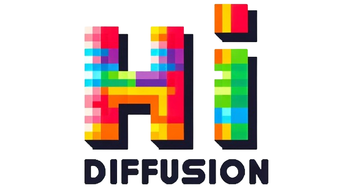
</div>

### <div align="center">💡 HiDiffusion: Unlocking Higher-Resolution Creativity and Efficiency in Pretrained Diffusion Models</div> 

<div align="center">Shen Zhang, Zhaowei Chen, Zhenyu Zhao, Yuhao Chen, Yao Tang, Jiajun Liang</div> 

<br>

<div align="center">
  <a href="https://hidiffusion.github.io/"></a> &ensp;
  <a href="https://arxiv.org/abs/2311.17528"></a> &ensp;
  <a href="https://colab.research.google.com/drive/1EiBn9lSnPZTU4cikRRaBBexs429M-qty?usp=sharing"></a> &ensp;
</div>

<div align="center">
  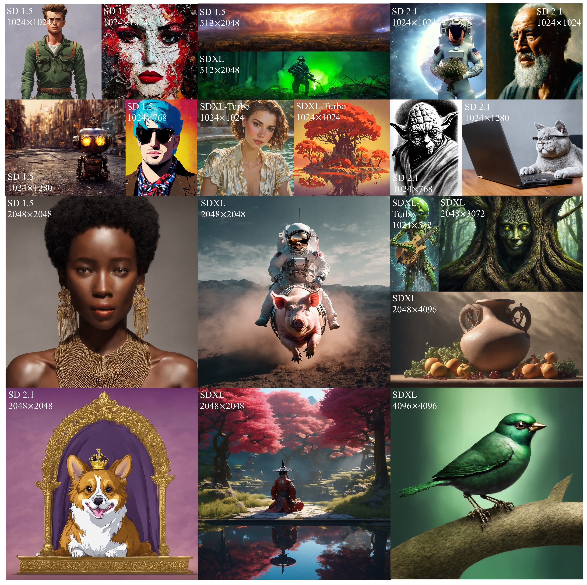</img>
  <br>
  <em>
      (Select HiDiffusion samples for various diffusion models, resolutions, and aspect ratios.) 
  </em>
</div>
<br>


## 👉 Why HiDiffusion

- A  **training-free method that increases the resolution and speed of pretrained diffusion models.**
- Designed as a **plug-and-play implementation**. It can be integrated into diffusion pipelines by **only adding a single line of code**!
- Supports various tasks, including **text-to-image, image-to-image, inpainting**.

<div align="center">
  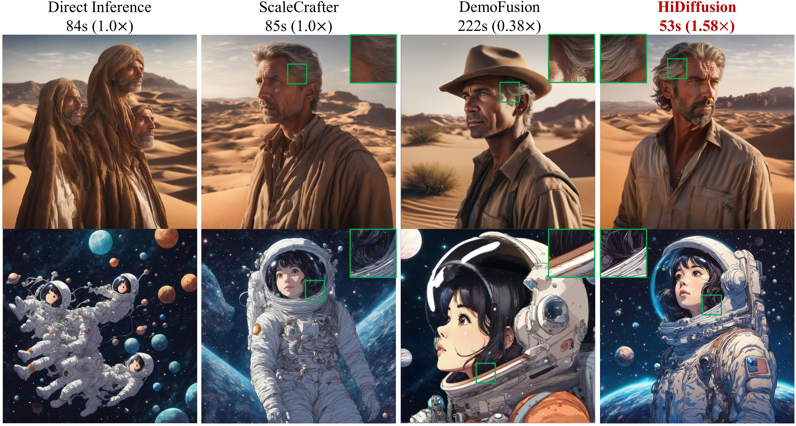</img>
  <br>
  <em>
      (Faster, and better image details.) 
  </em>
</div>
<br>

<div align="center">
  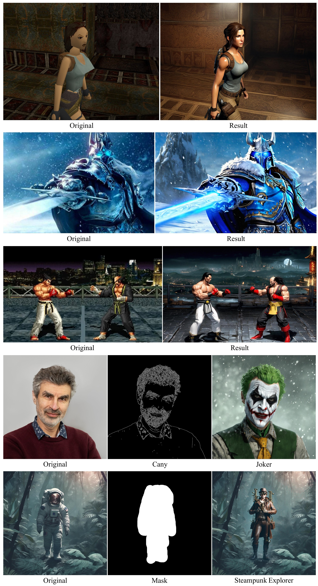</img>
  <br>
  <em>
      (2K results of ControlNet and inpainting tasks.) 
  </em>
</div>
<br>

## 🔥 Update
- 2024.5.7 - 💥 Support image-to-image task, see [here](#image-to-image-generation).

- 2024.4.16 - 💥 Release source code.


## 📢 Supported Models

- ✅ [Stable Diffusion XL](https://huggingface.co/papers/2307.01952)
- ✅ [Stable Diffusion XL Turbo](https://huggingface.co/stabilityai/sdxl-turbo)
- ✅ [Stable Diffusion v2](https://huggingface.co/stabilityai/stable-diffusion-2-1)
- ✅ [Stable Diffusion v1](https://huggingface.co/runwayml/stable-diffusion-v1-5)

**Note**: HiDiffusion also supports the downstream diffusion models based on these repositories, such as [Ghibli-Diffusion](https://huggingface.co/nitrosocke/Ghibli-Diffusion), [Playground](https://huggingface.co/playgroundai/playground-v2-1024px-aesthetic), etc.

## 💣 Supported Tasks

- ✅ Text-to-image
- ✅ ControlNet, including text-to-image, image-to-image
- ✅ Inpainting


## 🔎 Main Requirements
This repository is tested on
* Python==3.8
* torch==1.13.1
* diffusers==0.27.0
* transformers==4.27.4
* accelerate==0.18.0
* xformers==0.0.16rc425

## 🔑 Install HiDiffusion
After installing the packages in the [main requirements](#-main-requirements), install HiDiffusion:
```shell
pip3 install hidiffusion
```
### Installing from source
Alternatively, you can install from github source. Clone the repository and install:
```bash
git clone https://github.com/megvii-model/HiDiffusion.git
cd HiDiffusion
python3 setup.py install
```


## 🚀 Usage

Generating outputs with HiDiffusion is super easy based on 🤗 [diffusers](https://github.com/huggingface/diffusers/tree/main). **You just need to add a single line of code**.

## Text-to-image generation

### Stable Diffusion XL

```python
from hidiffusion import apply_hidiffusion, remove_hidiffusion
from diffusers import StableDiffusionXLPipeline, DDIMScheduler
import torch
pretrain_model = "stabilityai/stable-diffusion-xl-base-1.0"
scheduler = DDIMScheduler.from_pretrained(pretrain_model, subfolder="scheduler")
pipe = StableDiffusionXLPipeline.from_pretrained(pretrain_model, scheduler = scheduler, torch_dtype=torch.float16, variant="fp16").to("cuda")

# # Optional. enable_xformers_memory_efficient_attention can save memory usage and increase inference speed. enable_model_cpu_offload and enable_vae_tiling can save memory usage.
# pipe.enable_xformers_memory_efficient_attention()
# pipe.enable_model_cpu_offload()
# pipe.enable_vae_tiling()

# Apply hidiffusion with a single line of code.
apply_hidiffusion(pipe)

prompt = "Standing tall amidst the ruins, a stone golem awakens, vines and flowers sprouting from the crevices in its body."
negative_prompt = "blurry, ugly, duplicate, poorly drawn face, deformed, mosaic, artifacts, bad limbs"
image = pipe(prompt, guidance_scale=7.5, height=2048, width=2048, eta=1.0, negative_prompt=negative_prompt).images[0]
image.save(f"golem.jpg")
```

<details>
<summary>Output:</summary>
<div align="center">
  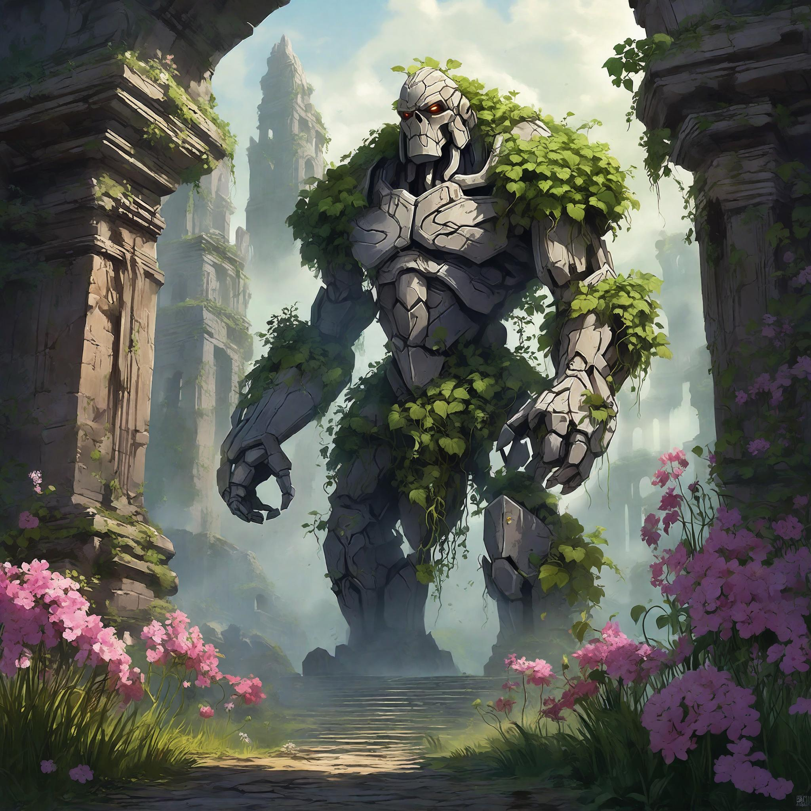</img>
</div>
</details>

Set height = 4096, width = 4096, and you can get output with 4096x4096 resolution.

### Stable Diffusion XL Turbo

```python
from hidiffusion import apply_hidiffusion, remove_hidiffusion
from diffusers import AutoPipelineForText2Image
import torch
pretrain_model = "stabilityai/sdxl-turbo"
pipe = AutoPipelineForText2Image.from_pretrained(pretrain_model, torch_dtype=torch.float16, variant="fp16").to('cuda')

# # Optional. enable_xformers_memory_efficient_attention can save memory usage and increase inference speed. enable_model_cpu_offload and enable_vae_tiling can save memory usage.
# pipe.enable_xformers_memory_efficient_attention()
# pipe.enable_model_cpu_offload()
# pipe.enable_vae_tiling()

# Apply hidiffusion with a single line of code.
apply_hidiffusion(pipe)

prompt = "In the depths of a mystical forest, a robotic owl with night vision lenses for eyes watches over the nocturnal creatures."
image = pipe(prompt, num_inference_steps=4, height=1024, width=1024, guidance_scale=0.0).images[0]
image.save(f"./owl.jpg")
```

<details>
<summary>Output:</summary>
<div align="center">
  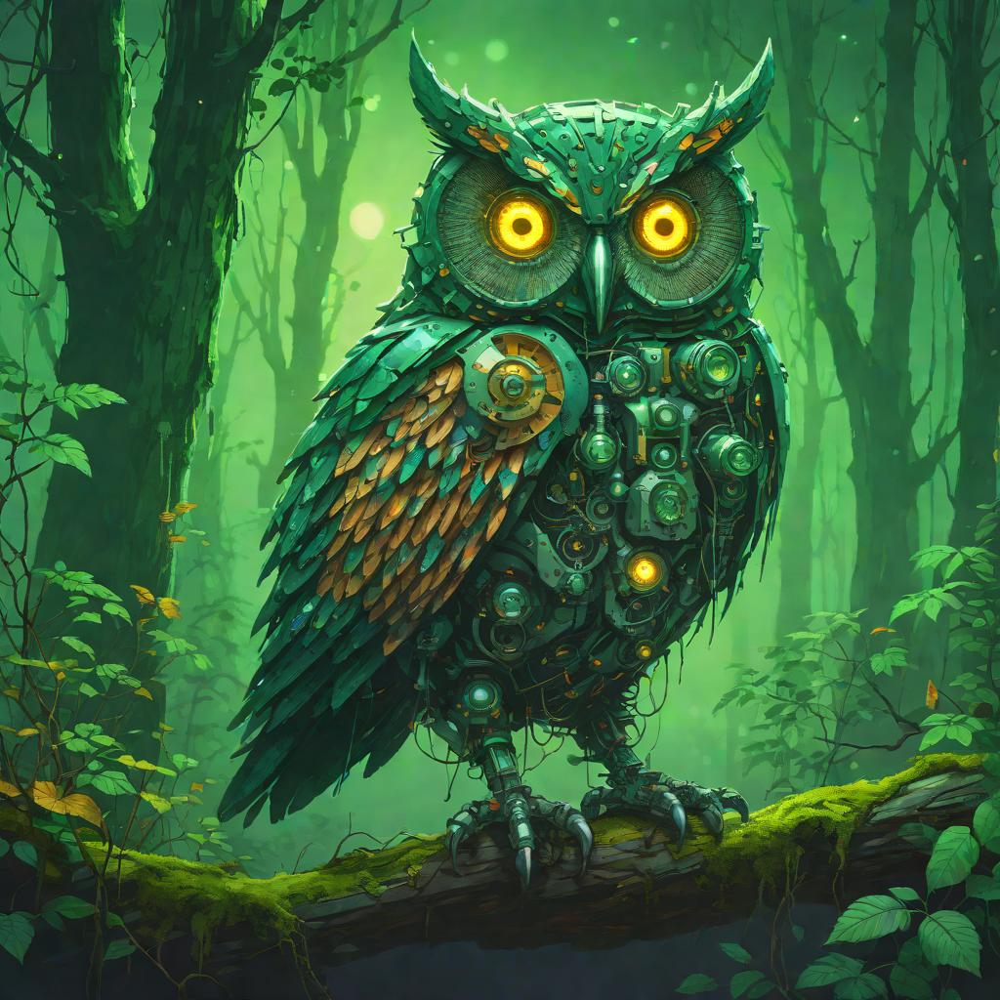</img>
</div>
</details>

### Stable Diffusion v2-1

```python
from hidiffusion import apply_hidiffusion, remove_hidiffusion
from diffusers import DiffusionPipeline, DDIMScheduler
import torch
pretrain_model = "stabilityai/stable-diffusion-2-1-base"
scheduler = DDIMScheduler.from_pretrained(pretrain_model, subfolder="scheduler")
pipe = DiffusionPipeline.from_pretrained(pretrain_model, scheduler = scheduler, torch_dtype=torch.float16).to("cuda")

# # Optional. enable_xformers_memory_efficient_attention can save memory usage and increase inference speed. enable_model_cpu_offload and enable_vae_tiling can save memory usage.
# pipe.enable_xformers_memory_efficient_attention()
# pipe.enable_model_cpu_offload()
# pipe.enable_vae_tiling()

# Apply hidiffusion with a single line of code.
apply_hidiffusion(pipe)

prompt = "An adorable happy brown border collie sitting on a bed, high detail."
negative_prompt = "ugly, tiling, out of frame, poorly drawn face, extra limbs, disfigured, deformed, body out of frame, blurry, bad anatomy, blurred, artifacts, bad proportions."
image = pipe(prompt, guidance_scale=7.5, height=1024, width=1024, eta=1.0, negative_prompt=negative_prompt).images[0]
image.save(f"collie.jpg")
```

<details>
<summary>Output:</summary>
<div align="center">
  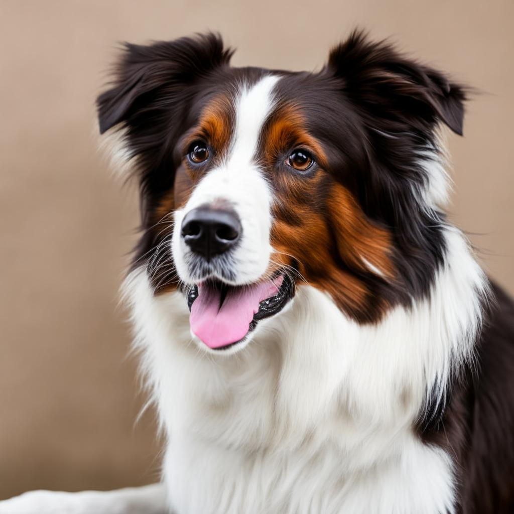</img>
</div>
</details>

Set height = 2048, width = 2048, and you can get output with 2048x2048 resolution.


### Stable Diffusion v1-5

```python
from hidiffusion import apply_hidiffusion, remove_hidiffusion
from diffusers import DiffusionPipeline, DDIMScheduler
import torch
pretrain_model = "runwayml/stable-diffusion-v1-5"
scheduler = DDIMScheduler.from_pretrained(pretrain_model, subfolder="scheduler")
pipe = DiffusionPipeline.from_pretrained(pretrain_model, scheduler = scheduler, torch_dtype=torch.float16).to("cuda")

# # Optional. enable_xformers_memory_efficient_attention can save memory usage and increase inference speed. enable_model_cpu_offload and enable_vae_tiling can save memory usage.
# pipe.enable_xformers_memory_efficient_attention()
# pipe.enable_model_cpu_offload()
# pipe.enable_vae_tiling()

# Apply hidiffusion with a single line of code.
apply_hidiffusion(pipe)

prompt = "thick strokes, bright colors, an exotic fox, cute, chibi kawaii. detailed fur, hyperdetailed , big reflective eyes, fairytale, artstation,centered composition, perfect composition, centered, vibrant colors, muted colors, high detailed, 8k."
negative_prompt = "ugly, tiling, poorly drawn face, out of frame, disfigured, deformed, blurry, bad anatomy, blurred."
image = pipe(prompt, guidance_scale=7.5, height=1024, width=1024, eta=1.0, negative_prompt=negative_prompt).images[0]
image.save(f"fox.jpg")
```

<details>
<summary>Output:</summary>
<div align="center">
  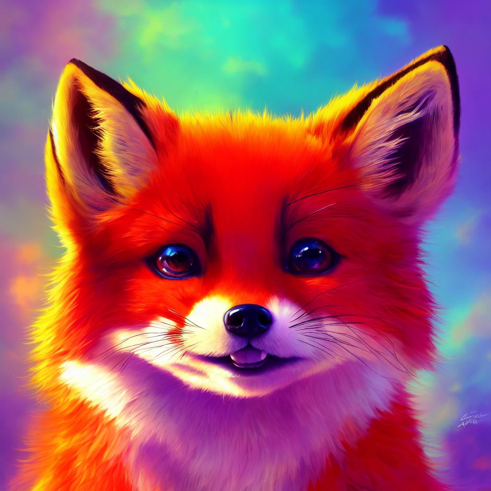</img>
</div>
</details>

Set height = 2048, width = 2048, and you can get output with 2048x2048 resolution.

### Remove HiDiffusion

If you want to remove HiDiiffusion, simply use `remove_hidiffusion(pipe)`.

## ControlNet

### Text-to-image generation
```python
from diffusers import StableDiffusionXLControlNetPipeline, ControlNetModel, DDIMScheduler
import numpy as np
import torch
import cv2
from PIL import Image
from hidiffusion import apply_hidiffusion, remove_hidiffusion

# load Yoshua_Bengio.jpg in the assets file.
path = './assets/Yoshua_Bengio.jpg'
image = Image.open(path)
# get canny image
image = np.array(image)
image = cv2.Canny(image, 100, 200)
image = image[:, :, None]
image = np.concatenate([image, image, image], axis=2)
canny_image = Image.fromarray(image)

# initialize the models and pipeline
controlnet_conditioning_scale = 0.5  # recommended for good generalization
controlnet = ControlNetModel.from_pretrained(
    "diffusers/controlnet-canny-sdxl-1.0", torch_dtype=torch.float16, variant="fp16"
)
scheduler = DDIMScheduler.from_pretrained("stabilityai/stable-diffusion-xl-base-1.0", subfolder="scheduler")
pipe = StableDiffusionXLControlNetPipeline.from_pretrained(
    "stabilityai/stable-diffusion-xl-base-1.0", controlnet=controlnet, torch_dtype=torch.float16,
    scheduler = scheduler
)

# Apply hidiffusion with a single line of code.
apply_hidiffusion(pipe)

pipe.enable_model_cpu_offload()
pipe.enable_xformers_memory_efficient_attention()

prompt = "The Joker, high face detail, high detail, muted color, 8k"
negative_prompt = "blurry, ugly, duplicate, poorly drawn, deformed, mosaic."

image = pipe(
    prompt, controlnet_conditioning_scale=controlnet_conditioning_scale, image=canny_image,
    height=2048, width=2048, guidance_scale=7.5, negative_prompt = negative_prompt, eta=1.0
).images[0]

image.save('joker.jpg')
```

<details>
<summary>Output:</summary>
<div align="center">
  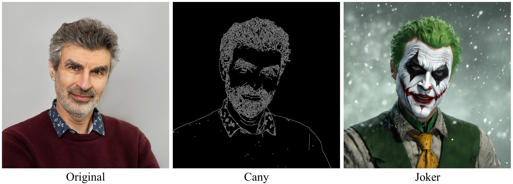</img>
</div>
</details>


### Image-to-image generation
```python
import torch
import numpy as np
from PIL import Image
from diffusers import ControlNetModel, StableDiffusionXLControlNetImg2ImgPipeline, DDIMScheduler
from hidiffusion import apply_hidiffusion, remove_hidiffusion
import cv2 

controlnet = ControlNetModel.from_pretrained(
    "diffusers/controlnet-canny-sdxl-1.0", torch_dtype=torch.float16, variant="fp16"
).to("cuda")
scheduler = DDIMScheduler.from_pretrained("stabilityai/stable-diffusion-xl-base-1.0", subfolder="scheduler")

pipe = StableDiffusionXLControlNetImg2ImgPipeline.from_pretrained(
    "stabilityai/stable-diffusion-xl-base-1.0",
    controlnet=controlnet,
    scheduler = scheduler,
    torch_dtype=torch.float16,
).to("cuda")

# Apply hidiffusion with a single line of code.
apply_hidiffusion(pipe)

pipe.enable_model_cpu_offload()
pipe.enable_xformers_memory_efficient_attention()

path = './assets/lara.jpeg'
ori_image = Image.open(path)
# get canny image
image = np.array(ori_image)
image = cv2.Canny(image, 50, 120)
image = image[:, :, None]
image = np.concatenate([image, image, image], axis=2)
canny_image = Image.fromarray(image)

controlnet_conditioning_scale = 0.5  # recommended for good generalization
prompt = "Lara Croft with brown hair, and is wearing a tank top, a brown backpack. The room is dark and has an old-fashioned decor with a patterned floor and a wall featuring a design with arches and a dark area on the right side, muted color, high detail, 8k high definition award winning"
negative_prompt = "underexposed, poorly drawn hands, duplicate hands, overexposed, bad art, beginner, amateur, abstract, disfigured, deformed, close up, weird colors, watermark"

image = pipe(prompt,
    image=ori_image,
    control_image=canny_image,
    height=1536,
    width=2048,
    strength=0.99,
    num_inference_steps=50,
    controlnet_conditioning_scale=controlnet_conditioning_scale,
    guidance_scale=12.5,
    negative_prompt = negative_prompt,
    eta=1.0
).images[0]

image.save("lara.jpg")
```

<details>
<summary>Output:</summary>
<div align="center">
  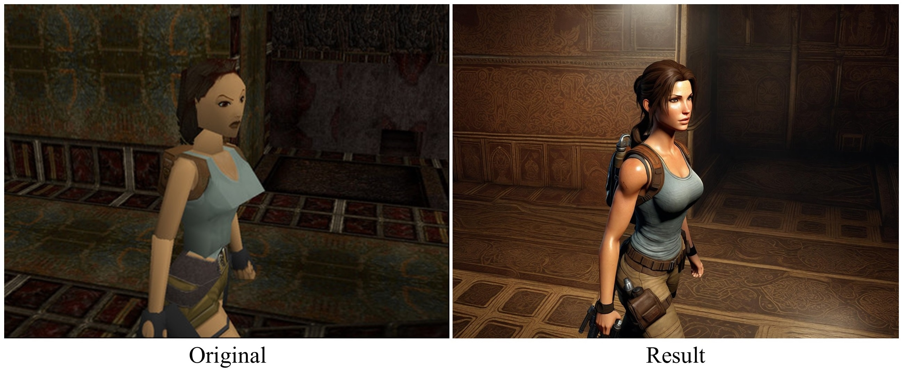</img>
</div>
</details>

## Inpainting

```python
import torch
from diffusers import AutoPipelineForInpainting, DDIMScheduler
from diffusers.utils import load_image
from hidiffusion import apply_hidiffusion, remove_hidiffusion
from PIL import Image

scheduler = DDIMScheduler.from_pretrained("stabilityai/stable-diffusion-xl-base-1.0", subfolder="scheduler")
pipeline = AutoPipelineForInpainting.from_pretrained(
    "diffusers/stable-diffusion-xl-1.0-inpainting-0.1", torch_dtype=torch.float16, variant="fp16", 
    scheduler=scheduler
)

# Apply hidiffusion with a single line of code.
apply_hidiffusion(pipeline)

pipeline.enable_model_cpu_offload()
# remove following line if xFormers is not installed
pipeline.enable_xformers_memory_efficient_attention()

# load base and mask image
img_url = "https://huggingface.co/datasets/huggingface/documentation-images/resolve/main/diffusers/sdxl-text2img.png"
init_image = load_image(img_url)
# load mask_image.jpg in the assets file.
mask_image = Image.open("./assets/mask_image.png")

prompt =  "A steampunk explorer in a leather aviator cap and goggles, with a brass telescope in hand, stands amidst towering ancient trees, their roots entwined with intricate gears and pipes."

negative_prompt = "blurry, ugly, duplicate, poorly drawn, deformed, mosaic"
image = pipeline(prompt=prompt, image=init_image, mask_image=mask_image, height=2048, width=2048, strength=0.85, guidance_scale=12.5, negative_prompt = negative_prompt, eta=1.0).images[0]
image.save('steampunk_explorer.jpg')
```

<details>
<summary>Output:</summary>
<div align="center">
  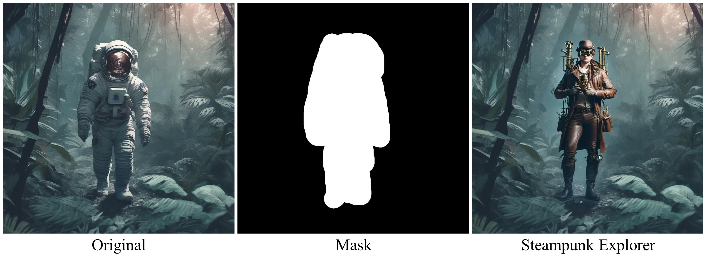</img>
</div>
</details>


## Integration into downstream models
HiDiffusion supports models based on [supported models](#-supported-models), such as [Ghibli-Diffusion](https://huggingface.co/nitrosocke/Ghibli-Diffusion), [Playground](https://huggingface.co/playgroundai/playground-v2-1024px-aesthetic), etc.

### Ghibli-Diffusion
```python
from diffusers import StableDiffusionPipeline
import torch
from hidiffusion import apply_hidiffusion, remove_hidiffusion

model_id = "nitrosocke/Ghibli-Diffusion"
pipe = StableDiffusionPipeline.from_pretrained(model_id, torch_dtype=torch.float16)
pipe = pipe.to("cuda")

# Apply hidiffusion with a single line of code.
apply_hidiffusion(pipe)

prompt = "ghibli style magical princess with golden hair"
negative_prompt="blurry, ugly, duplicate, poorly drawn face, deformed, mosaic, artifacts, bad limbs"
image = pipe(prompt, height=1024, width=1024, eta=1.0, negative_prompt=negative_prompt).images[0]

image.save("./magical_princess.jpg")
```
<details>
<summary>Output:</summary>
<div align="center">
  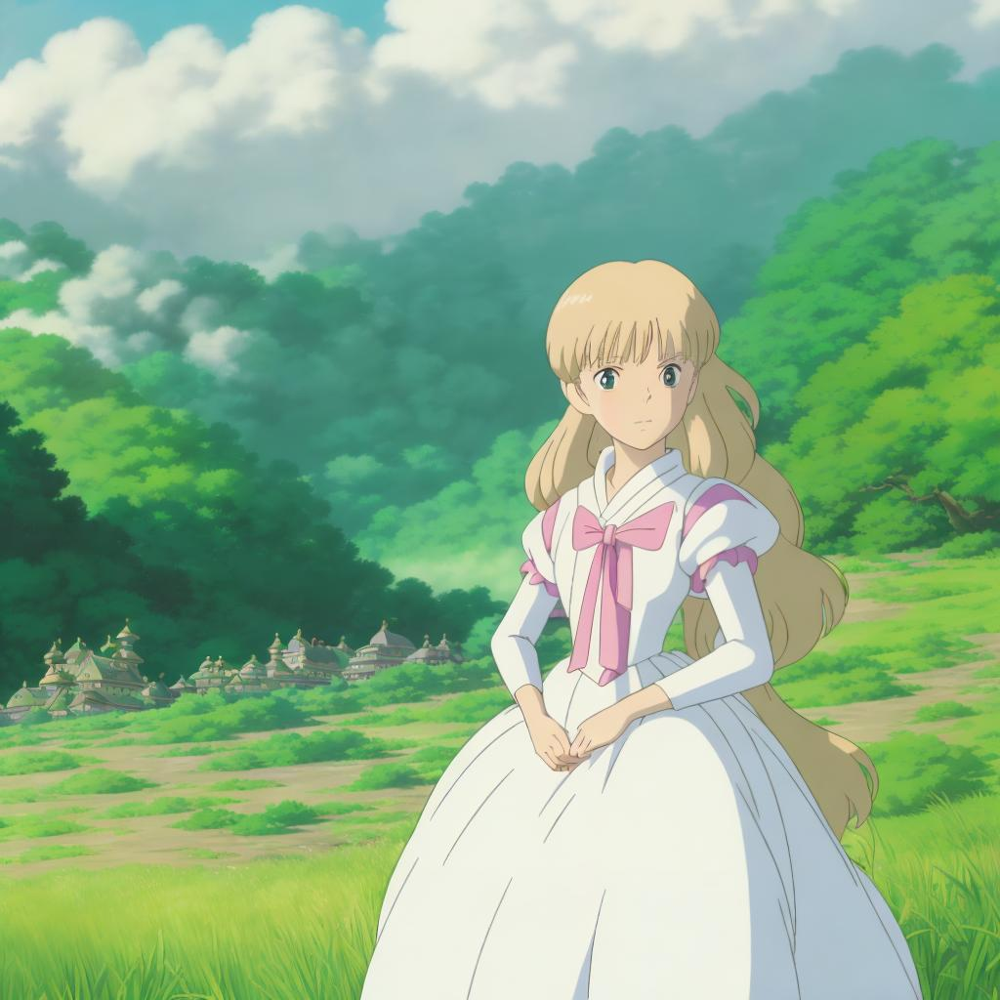</img>
</div>
</details>

### Playground

```python
from diffusers import DiffusionPipeline
import torch
from hidiffusion import apply_hidiffusion, remove_hidiffusion

pipe = DiffusionPipeline.from_pretrained(
    "playgroundai/playground-v2-1024px-aesthetic",
    torch_dtype=torch.float16,
    use_safetensors=True,
    add_watermarker=False,
    variant="fp16"
)
pipe.to("cuda")
pipe.enable_xformers_memory_efficient_attention()

# Apply hidiffusion with a single line of code.
apply_hidiffusion(pipe)

prompt = "The little girl riding a bike, in a beautiful anime scene by Hayao Miyazaki: a snowy Tokyo city with massive Miyazaki clouds floating in the blue sky, enchanting snowscapes of the city with bright sunlight, Miyazaki's landscape imagery, Japanese art"
negative_prompt="blurry, ugly, duplicate, poorly drawn, deformed, mosaic"
image  = pipe(prompt=prompt, guidance_scale=3.0, height=2048, width=2048, negative_prompt=negative_prompt).images[0]
image.save('girl.jpg')
```

Note: You may change guidance scale from 3.0 to 5.0 and design appropriate negative prompt to generate satisfactory results.

<details>
<summary>Output:</summary>
<div align="center">
  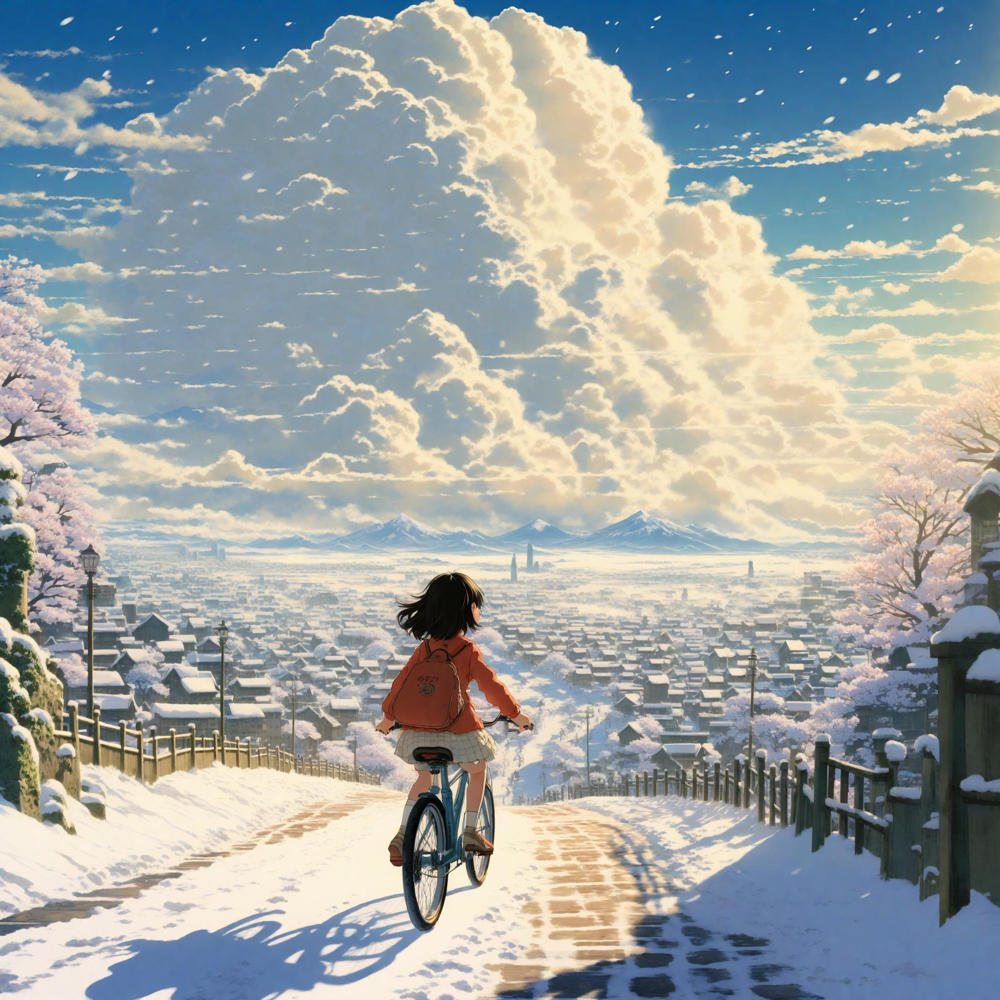</img>
</div>
</details>

## 🙏 Acknowledgements

This codebase is based on [tomesd](https://github.com/dbolya/tomesd) and [diffusers](https://github.com/huggingface/diffusers/tree/main). Thanks!


## 🎓 Citation

```
@article{zhang2023hidiffusion,
  title={HiDiffusion: Unlocking Higher-Resolution Creativity and Efficiency in Pretrained Diffusion Models},
  author={Zhang, Shen and Chen, Zhaowei and Zhao, Zhenyu and Chen, Yuhao and Tang, Yao and Liang, Jiajun},
  journal={arXiv preprint arXiv:2311.17528},
  year={2023}
}
```
